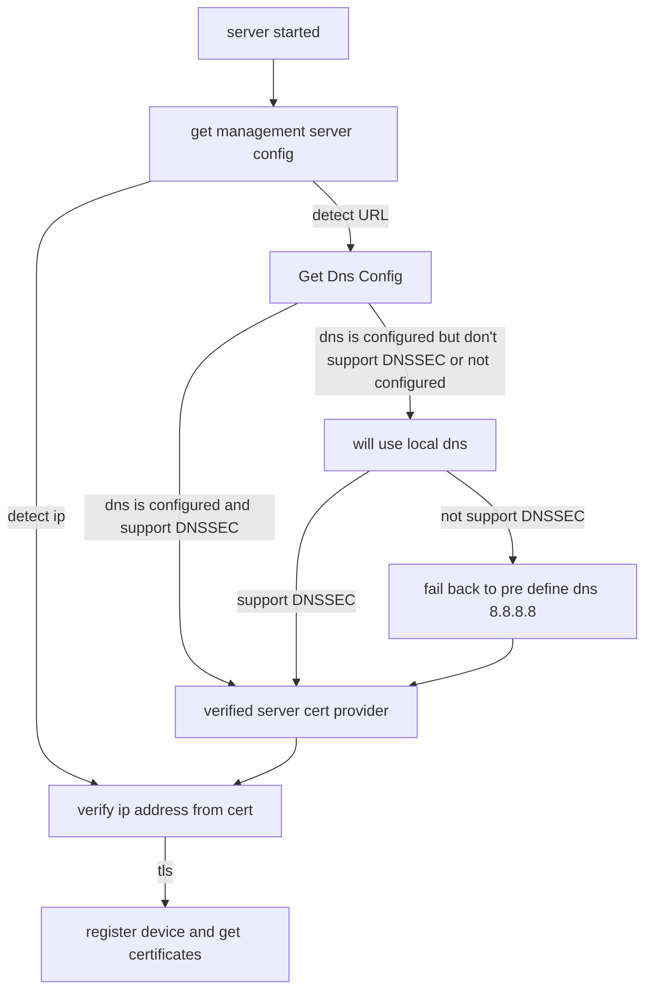

## Client Registration

### Process

```mermaid
  graph TB
    A[server started] --> B[get management server config]

    B --> |detect ip| C[verify ip address from cert]
    B --> |detect URL| D[Get Dns Config]
    D --> |dns is configured but don't support DNSSEC or not configured| F[ will use local dns]
    D --> |dns is configured and support DNSSEC| E[verified server cert provider] --> C
    F --> |support DNSSEC|E
    F --> | not support DNSSEC| G[fail back to pre define dns 8.8.8.8] --> E
    C --> |tls| H[register device and get certificates]
```